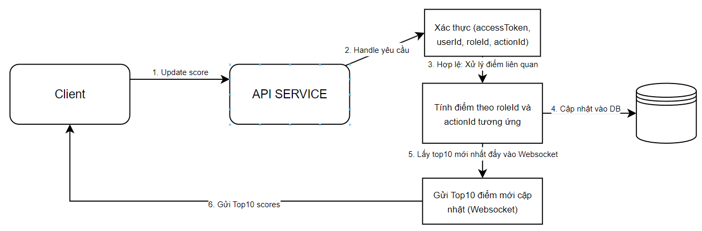
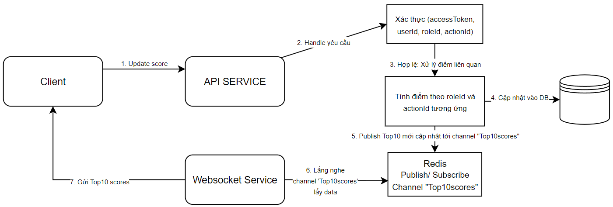

# Đặc tả Module API Bảng Xếp Hạng

## Tổng Quan

Module này chịu trách nhiệm quản lý và cập nhật bảng xếp hạng trên trang web.

- Bảng xếp hạng hiển thị điểm số của 10 người dùng hàng đầu
- Yêu cầu cập nhật trực tiếp khi người dùng thực hiện các hành động tăng điểm số.

## Yêu Cầu

1. Hiển thị điểm số của 10 người dùng hàng đầu trên bảng xếp hạng.
2. Cập nhật trực tiếp cho bảng xếp hạng.
3. Tăng điểm số của người dùng khi hoàn thành một hành động cụ thể.
4. Bảo mật cơ chế cập nhật điểm số để ngăn chặn việc thay đổi điểm số trái phép.

## API Endpoints

### 1. Lấy Top 10 Điểm Số

**URL:** `/api/scores/get-top10`
**Method:** `GET`
**Description:** Lấy danh sách điểm số của 10 người dùng hàng đầu (Cho lần đầu tải trang)

**Success Response example**

```json
{
    "message": "Get scores Top10 successfully",
    "status": 200,
    "metadata": [
      {
        "userId": "string",
        "username": "string",
        "score": "number"
      },
      ...
    ]
  }

```

### 2. Cập Nhật Điểm Số Người Dùng

**URL:** `/api/scores/update`
**Method:** `POST`
**Description:** - Cập nhật điểm số người dùng. `userId` và `roleId` được endcode từ accessToken đính kèm request. `actionId` là payload request.

    - Trường hợp giả định:

        - Từng `roleId` tương ứng với từng `actionId`.
        - Từng `actionId` tương ứng với số điểm được cộng thêm cho người dùng `userId`

- **Body:**

  ```json
  {
    "userId": "string",
    "roleId": "string",
    "actionId": "string"
  }
  ```

**Success Response example**

```json
{
  "message": "Score updated successfully",
  "status": 200
}
```

## WebSocket cho cập nhật trực tiếp điểm số

### Kết nối Websocket

**Endpoint:** `ws://<server>/ws/scores`
**Description:** -Thiết lập kết nối Websocket. Sau khi cập nhật điểm số người dùng, Websocket gửi về Front-end Top 10 điểm số người dùng.

## Về bảo mật

### 1. Xác thực người dùng, phân quyền:

    - Sử dụng JSON Web Token xác thực người dùng.
    - Middleware xác thực người dùng tại router.
    - Đảm bảo chỉ người dùng đã được xác thực mới có thể cập nhật điểm số của họ.

### 2. Xác thực hành động

    - Xác thực `actionId` có hợp lệ với `roleId` tương ứng.

## Sơ đồ luồng

    1. Người dùng thực hiện hoàn thành hành động.
    2. Front-end gọi API `/api/scores/update` với `accessToken` trong HEADER và `actionId` trong `req.body`
    3. Server xác thực yêu cầu.
    4. Tất cả hợp lệ, tiến hành cập nhật điểm số người dùng trong database.
    5. Sử dụng Websocket phản hồi danh sách Top 10 điểm số mới nhất (theo thời gian thực) cho Front-end.

### Diagram

**1. Luồng update hiện tại**



**2. Luồng update sử dụng Redis, triển khai Websocket service**



## Cải tiến

**1. Tối ưu lưu trữ, truy vấn cơ sở dữ liệu:**

    - Thực hiện đánh index `score` để truy xuất nhanh hơn.
    - Caching data để lưu trữ điểm số, ưu điểm nhanh hơn, giảm tải cơ sở dữ liệu chính (recomment Redis).

**2. Mở rộng:**

    - Triển khai server Websocket riêng để xử lý nhiều kết nối đồng thời.
    - Sử dụng Pub/Sub Redis để yêu cầu Websocket phản hồi Top10 mới khi vừa cập nhật điểm người dùng.

**3. Bảo mật:**

    - Áp dụng phương pháp bảo mật xác thực người dùng.
    - Kiểm tra, xác thực payload đầu vào dữ liệu.
    - Mở rộng theo dõi hành vi người dùng (ghi logs chi tiết), xử lý hành vi đáng nghi (API gọi liên tục trong thời gian quá ngắn, Điểm của 1 người dùng tăng đột ngột, ...)
